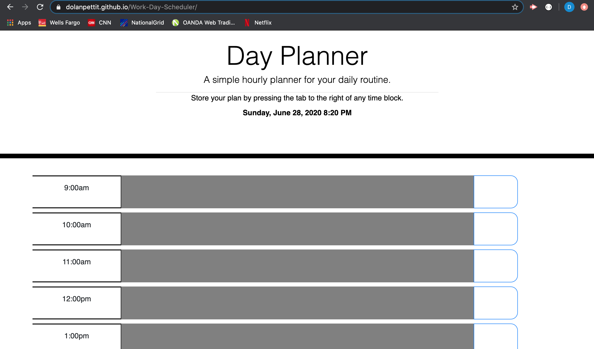

# Work-Day-Scheduler

The purpose of this exercise was to create a work day scheduler, that has an hour block for each hour of the work day (9AM - 5PM). The application contains HTML, CSS, Bootstrap, JavaScript, Jquery, and moment.js.

The first step was to create our index.html file, script.js file, and a file that contained our minified moment.js code. The index.html file was for the most part already constructed with a Jumbotron feature from Bootstrap, however I did have to manually add a container 'div' for our appended contents, as well as adding our scripts and link tags.

The next and most elaborate step was creating our script.js file and all the functions within it. The first function that creates our actual hour blocks is the addHourBlocks() function. This function takes in the parameter of iterations and runs a for loop so that for each iteration, an hour block is created. The hour blocks consist of the timeDiv, textDiv, and saveDiv. These correspond to the sections within each individual hour block: one 'div' containing the time for that block, one containing the 'textarea' for inputs, and the 'div' containing the save feature. The TimeDiv, TextDiv, and SaveDiv are all appended to a container 'div' denoted as PlanContainer, which is then appended to the container 'div' within the index.html file with an id='planner'.

After we have added our hour blocks we can move on to the second and most complex function which is the setBackgroundColor() function. The structure behind this function is that it initially declares two variables to compare the current time of day, and then compare that to the current hour block that is being focused on. Within the first block of code, we are actually comparing the letters 'a' and 'p' at first from the AM and PM portion of the time. If we arrive at a scenario where the code is comparing a 'p' to a 'p', we will compare the actual hours numbers. Depending on whether the values are equal, less than, or greater than one another determines the background color of the hour block.

The last piece of functionality that this application incorporates is the ability to save the users text into local storage. The on click function saves the time and the user input, and then assigns it to the block whenever the page is refreshed as long as the tab is still pressed to save the data. The one feature I did not have time nor the patience to implement was the actual lock that could unlock and lock as a way to visually confirm that your data was locked or unlocked.

This has been an incredible assignment to work on because of the amount of time that it took, being able to practice with re-using functions, and working with varibale scope. I'm very much looking forward to being able to implement AJAX into my code for the next assignment.

